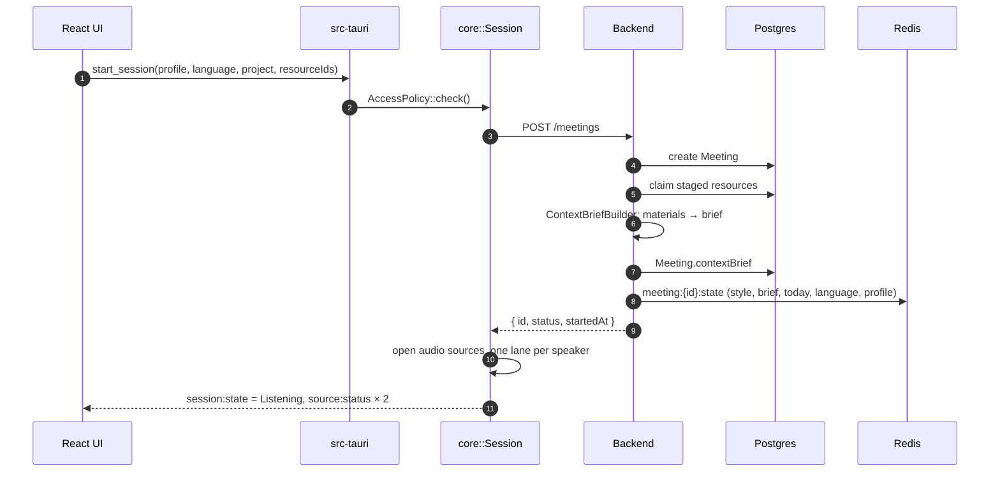
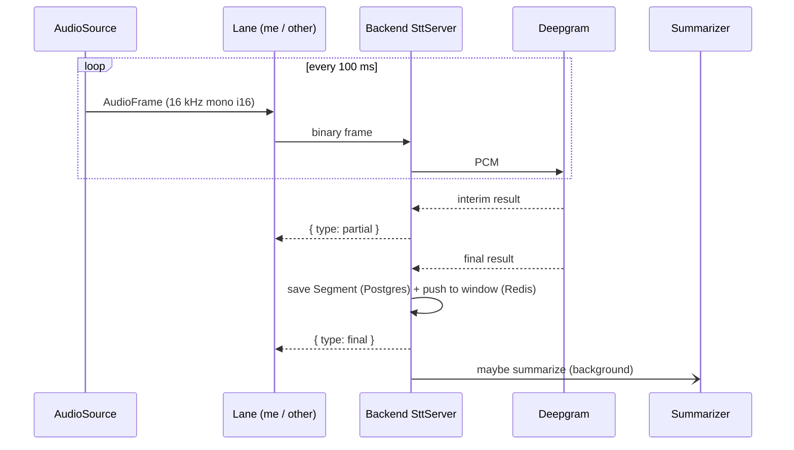
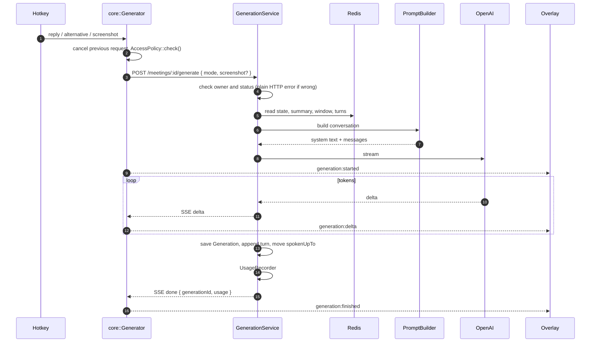
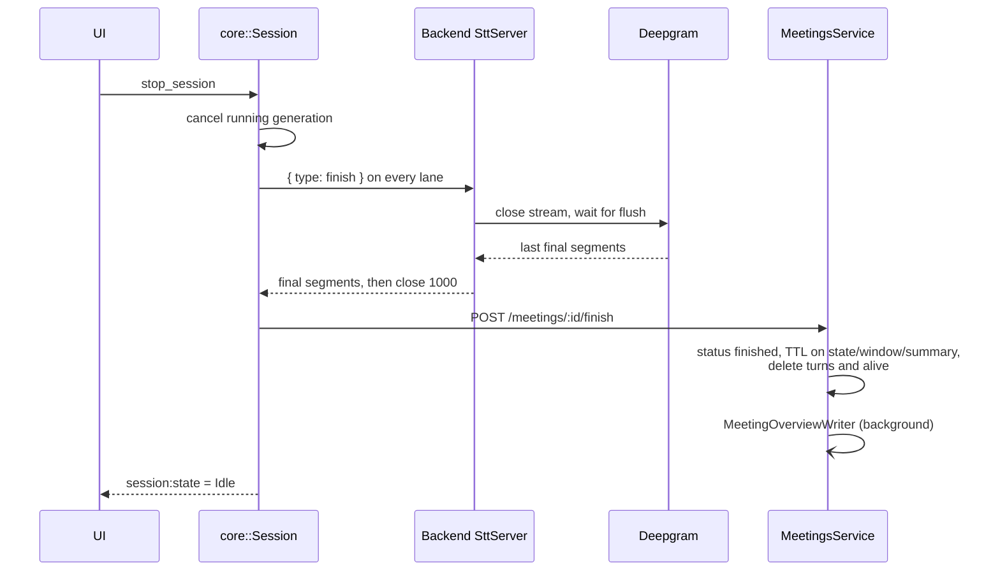

# A live meeting end to end

This page follows one meeting from the Start button to the history screen and names the code responsible at each step.

## 1. Start

What matters here:

- The **context brief, style and today's date freeze** into the meeting state at start. The system part of the prompt stays byte-for-byte the same for the whole meeting, so OpenAI's prefix cache keeps working. See [ADR-0007](../decisions/0007-stable-prompt-prefix.md).
- Materials for the meeting were uploaded **before** the meeting existed, as resources with `scope: meeting` and no `meetingId`. `POST /meetings` claims them right after creating the row. These are sequential steps, not one transaction: if a listed id is unknown, the request fails with 404 after the meeting row already exists. See [ADR-0010](../decisions/0010-materials-in-prompt-without-retrieval.md).
- Missing system audio does not block the start. The meeting runs with the microphone alone, and the reason comes back in `systemAudioProblem`.
- A failure during `Starting` returns to `Idle` and finishes the meeting on the backend if it was already created.

## 2. Listening

- Each speaker has its own **lane**: its own audio source, resampler and WebSocket. Speakers are known from the source, not guessed by diarization. See [ADR-0004](../decisions/0004-one-stream-per-speaker.md).
- Only **final** segments are stored. Interim ones go straight back to the client for display.
- After each final segment the `Summarizer` checks whether the text outside the window exceeds `SUMMARY_TRIGGER_CHARS`. If so, and the Redis lock is free, it compresses that part into the rolling summary in the background. Recognition never waits for it.
- While audio flows, the stream refreshes `meeting:{id}:alive`. If that key expires, `StaleMeetingsCloser` treats the meeting as abandoned.
- A dropped socket does not end the meeting: the lane reopens with backoff, up to five attempts. Codes 4401 and 4404 are not retried.

### Switching language

`PATCH /meetings/:id { language }` updates the row and the Redis state. The session exposes a `watch` channel; the lanes see the change, flush and close their sockets, and open new ones. The backend reads the language from the meeting row on connect. Audio sources never stop, so no phrase is lost.

## 3. Asking for a reply

- The prompt is a **conversation with roles**, not one big block. Each turn is "what was said since the previous draft" (user) and "the draft we gave" (assistant). How it is assembled: [AI pipeline](../backend/ai-pipeline.md#promptbuilder).
- `alternative` rewrites the last turn instead of adding a new one, so retries do not pile up in history.
- A **screenshot** rides in the request body and lands inside the turn it came with. Only the newest image stays in the turn log. See [ADR-0011](../decisions/0011-in-process-screen-capture.md).
- If the client disconnects, the provider request is cancelled and the partial reply is still saved.

## 4. Stop

- The client ends a lane with a text `finish` message, not by dropping the socket. Deepgram only returns the last phrase after a flush, so dropping would lose it. The client keeps reading with a 5-second safeguard.
- The overlay empties: an `Idle` session holds neither transcript nor reply.
- Quitting the app mid-meeting goes through `RunEvent::Exit`, which stops the session and finishes the meeting within 5 seconds.

## 5. After the meeting

- `MeetingOverviewWriter` writes the three-sentence overview once, in the background. `GET /meetings/:id` waits for it if it is not ready yet; the running attempt is shared, so it is never paid for twice.
- The meeting screen reads `GET /meetings/:id`: overview, segments, generations, resources, usage.
- The meeting chat is a tool-using agent over the finished meeting. See [AI pipeline](../backend/ai-pipeline.md#meeting-chat).
- Redis keys of the meeting expire after `FINISHED_MEETING_TTL_SECONDS`. Postgres keeps everything.
