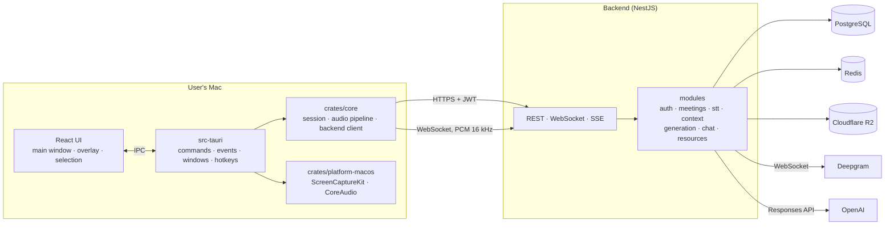
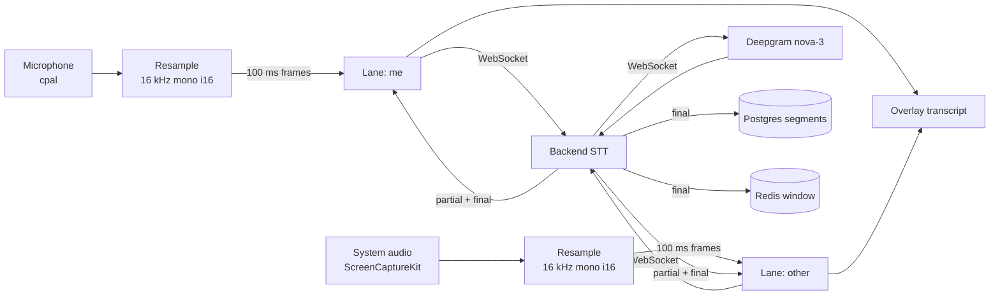
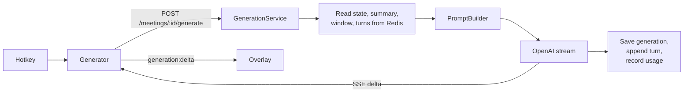

# Architecture overview

## The system at a glance

The repository is a pnpm workspace with two packages:

| Part                               | Role                                                                                           | Stack                                                                |
| ---------------------------------- | ---------------------------------------------------------------------------------------------- | -------------------------------------------------------------------- |
| [`backend/`](../backend/README.md) | Owns all product state and provider keys. Recognises speech, builds context, generates replies | NestJS 11, TypeScript, Prisma 7, PostgreSQL, Redis, OpenAI, Deepgram |
| [`desktop/`](../desktop/README.md) | Thin client. Captures audio, streams it to the backend, shows the transcript and replies       | Tauri 2, Rust, React 19, TypeScript, Tailwind, zustand               |

## Principles

1. **The backend is the source of truth.** Users, meetings, transcripts, summaries, settings and prompts live on the server. The app is a thin client: audio, hotkeys, overlay, display. It has no local database.
2. **Two parts, one contract.** The app and the backend talk only through the [API](../backend/api.md). Providers are known only to the backend.
3. **Postgres for what must survive everything, Redis for what is read on every request.** Redis holds the live meeting state and short-lived codes. Everything in Redis can be rebuilt from Postgres.
4. **The app core knows nothing about Tauri.** `desktop/crates/core` compiles and is tested without a UI and without macOS.
5. **Everything external hides behind an interface.** Audio sources, screen capture, secret storage, the backend client, the LLM, speech recognition and object storage are all traits or abstract classes. The composition root picks the implementation.
6. **Small files, one concept each.** A file does one thing and stays under roughly 200 lines. A module grows by splitting, not by getting longer.

## Who owns what

| Concern                         | Owner                       | Why                                                                                     |
| ------------------------------- | --------------------------- | --------------------------------------------------------------------------------------- |
| Provider keys                   | Backend `.env` only         | Anything inside a shipped binary can be extracted                                       |
| Prompts and model choice        | Backend                     | Can change without shipping a new app; cannot be tampered with                          |
| Transcript and meeting history  | Postgres                    | Survives restarts and is visible from any machine                                       |
| Live meeting context            | Redis                       | Read on every hotkey press, must be fast                                                |
| Original material files         | Cloudflare R2               | Large binaries do not belong in the database                                            |
| Audio capture, hotkeys, windows | App                         | Needs OS access                                                                         |
| Session tokens                  | App, Keychain               | The only secret the client has                                                          |
| Subscription decision           | Backend `SubscriptionGuard` | A client-side check can be cut out; the app's `AccessPolicy` only shows a paywall early |

## Main data flows

### Speech to transcript

### Hotkey to reply

The full step-by-step story is in [A live meeting end to end](live-meeting.md).

## Extension points

The first version leaves hooks where the next features will attach, without implementing them:

| Future feature                             | Where it plugs in                                          |
| ------------------------------------------ | ---------------------------------------------------------- |
| Subscription and limits                    | `SubscriptionGuard`, `UsageRecorder`, `AccessPolicy`       |
| Linux and Windows                          | A new `crates/platform-*` crate implementing `AudioSource` |
| Local Whisper                              | Another `SttProvider` implementation                       |
| Vector search over materials               | A new tool for the meeting chat agent                      |
| Memory across meetings, stored screenshots | New sources for `PromptBuilder`                            |
| Speaker diarization                        | The `Speaker` enum and the STT result mapper               |

## Further reading

- [A live meeting end to end](live-meeting.md)
- [Security and access](security.md)
- [Technical decisions](../decisions/README.md)
