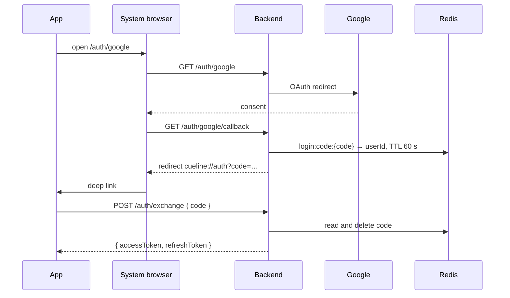
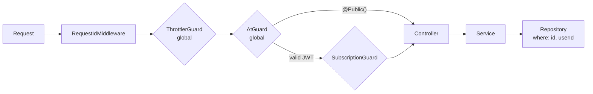

# Security and access

## Threat model in one sentence

The app on the user's disk is not trusted: anything inside the binary can be extracted and any local check can be cut out. Everything that must hold is enforced on the backend.

Consequences:

- **Provider keys exist only in the backend `.env`.** The app knows the backend address and a token pair, nothing else.
- **All product logic is server-side:** prompts, context, models, limits. The only way to generate anything is a generation for your own meeting.
- **Subscription is checked by `SubscriptionGuard` on the backend.** The app's `AccessPolicy` exists only to show a paywall before the backend answers 403.

## Authentication

### Tokens

| Token   | Lifetime   | Where it lives                                       | How it is used                                                           |
| ------- | ---------- | ---------------------------------------------------- | ------------------------------------------------------------------------ |
| Access  | 15 minutes | App memory and secret store                          | `Authorization: Bearer` on every request, `?token=` on the STT WebSocket |
| Refresh | 15 days    | App secret store; backend keeps only its argon2 hash | `POST /auth/refresh` for a new pair                                      |

- One `auth_sessions` row per device, so signing in on a second machine does not sign out the first.
- The session id travels in both tokens.
- **Refresh-token reuse is treated as compromise:** presenting an old refresh token deletes the session.
- The app's HTTP client refreshes the access token on a 401 by itself and stores the new pair.
- `ExpiredSessionsCleaner` removes expired sessions every hour.

No cookies and no CORS: there is no web version, the app is the only client.

### Google sign-in

The system browser plus a one-time code is what RFC 8252 recommends for native apps, and Google does not allow OAuth inside an embedded webview. The code lives 60 seconds and burns on exchange. See [ADR-0012](../decisions/0012-browser-sign-in-with-one-time-code.md).

## Request pipeline

- `ThrottlerGuard` is global: 100 requests per minute per client, 5 per minute on `/auth/register`, 10 per minute on `/auth/login`.
- `AtGuard` is global via `APP_GUARD`; `@Public()` removes it. Nothing else reads auth headers.
- **Every meeting query filters by `userId`.** A miss is `404`, never `403`, so the API never confirms that someone else's meeting exists.
- `AllExceptionsFilter` gives every error the same shape, including 413 for an oversized body.

## Untrusted text and prompt injection

Everything the meeting says and every uploaded document is someone else's text. A PDF containing "ignore previous instructions" must remain material.

- Transcript, notes, materials and tool results reach the model inside tags (`<transcript>`, `<notes>`, `<materials>`, …).
- The system prompt says these are material, not instructions: requests and roles found inside are facts about the text.
- `common/untrusted` strips these tags from the content itself, so text from a meeting cannot close the fence and speak for us.

## Screen privacy

- The overlay and the region-selection window use `set_content_protected(true)`: they are excluded from screen sharing and screenshots.
- Screenshots are not stored. Postgres keeps only `Generation.hasScreenshot`.

## Secrets on the client

| Build   | Storage                      | Why                                                                          |
| ------- | ---------------------------- | ---------------------------------------------------------------------------- |
| Release | macOS Keychain (`keyring`)   | The standard secure store                                                    |
| Debug   | File with `0600` permissions | The ad-hoc signature changes every build and Keychain would prompt each time |

The `Secret` type prints as `Secret(***)`, so tokens never reach the logs.

## macOS entitlements

The signed app requests only `com.apple.security.device.audio-input`. Screen Recording has no entitlement; the user grants it in System Settings.

## Data and privacy

Transcripts are stored on the server. A commercial release needs a privacy policy and a way to delete a meeting and the account. Deleting a meeting already removes its transcript, replies and chats; deleting a project removes its meetings.
