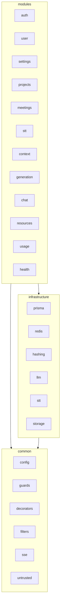

# Backend structure

The backend is a NestJS 11 application in strict TypeScript. It owns every piece of product state and is the only part that talks to AI providers.

## Stack

| Concern              | Choice                                               |
| -------------------- | ---------------------------------------------------- |
| Framework            | NestJS 11                                            |
| Database             | PostgreSQL 17 via Prisma 7 with `@prisma/adapter-pg` |
| Cache and live state | Redis 7 via ioredis                                  |
| Auth                 | passport-jwt, passport-google-oauth20, argon2        |
| Config               | zod schema validated at startup                      |
| API docs             | Swagger at `/api/v1/docs`                            |
| Speech               | Deepgram nova-3 over a plain `ws` WebSocket, no SDK  |
| Generation           | `openai` SDK, Responses API                          |
| File storage         | Cloudflare R2 via `@aws-sdk/client-s3`               |
| PDF text             | `unpdf`                                              |
| Scheduling           | `@nestjs/schedule`                                   |
| Rate limiting        | `@nestjs/throttler`                                  |
| Tests                | Jest, supertest                                      |

## Layers

```
backend/src
├── main.ts, app.module.ts
├── common/           cross-cutting pieces with no business logic
├── infrastructure/   adapters to the outside world
└── modules/          business features
```



### `common/`

| Folder        | Contents                                                                        |
| ------------- | ------------------------------------------------------------------------------- |
| `config/`     | `env.schema.ts` — the zod schema and `validateEnv`                              |
| `decorators/` | `@Public()`, `@GetCurrentUserId()`, `@GetCurrentUser()`, `@GetRefreshSession()` |
| `dto/`        | Shared response classes for Swagger                                             |
| `filters/`    | `AllExceptionsFilter` — one error shape for everything                          |
| `guards/`     | `AtGuard`, `RtGuard`, `GoogleGuard`, `SubscriptionGuard`                        |
| `middleware/` | `RequestIdMiddleware` — a request id in every log line                          |
| `sse/`        | `SseWriter` — hand-written SSE frames over a `POST` response                    |
| `untrusted/`  | Fences for third-party text going into prompts                                  |

### `infrastructure/`

Each adapter is an abstract class the modules depend on, plus one real implementation.

| Folder     | Interface                | Implementation                                                   |
| ---------- | ------------------------ | ---------------------------------------------------------------- |
| `prisma/`  | `PrismaService` (global) | Postgres through `@prisma/adapter-pg`                            |
| `redis/`   | `RedisService` (global)  | ioredis with typed helpers                                       |
| `hashing/` | `HashingService`         | argon2                                                           |
| `llm/`     | `LlmProvider`            | `OpenAiLlmProvider`: streaming, tool calls, usage, error mapping |
| `stt/`     | `SttProvider`            | `DeepgramSttProvider`: live WebSocket, result mapping            |
| `storage/` | `ObjectStorage`          | `R2ObjectStorage`: `put` and `delete`                            |

Tests swap these for fakes, so e2e tests run without any provider.

### `modules/`

| Module       | Responsibility                                                         | Key classes                                                                                                  |
| ------------ | ---------------------------------------------------------------------- | ------------------------------------------------------------------------------------------------------------ |
| `auth`       | Email and password, JWT pair, Google OAuth, one-time desktop code      | `AuthService`, `JwtTokenService`, `LoginCodeService`, `ExpiredSessionsCleaner`                               |
| `user`       | Profile                                                                | `UserService`                                                                                                |
| `settings`   | Style, default language and profile                                    | `SettingsService`, `SettingsCache`                                                                           |
| `projects`   | Groups of meetings                                                     | `ProjectsService`                                                                                            |
| `resources`  | Materials on three levels, text extraction, digests, the context brief | `ResourceIngestor`, `ResourceExtractor`, `ResourceDigester`, `ContextBriefBuilder`, `StagedResourcesSweeper` |
| `meetings`   | Meeting lifecycle, live state in Redis, overview                       | `MeetingsService`, `MeetingStateStore`, `MeetingOverviewWriter`, `StaleMeetingsCloser`                       |
| `stt`        | WebSocket gateway between the app and Deepgram                         | `SttServer`, `SttConnection`, `SttAuthenticator`                                                             |
| `context`    | Fresh window and rolling summary                                       | `ContextWindow`, `Summarizer`, `TranscriptFormatter`                                                         |
| `generation` | Replies over SSE                                                       | `GenerationService`, `PromptBuilder`, prompts                                                                |
| `chat`       | Questions about a finished meeting                                     | `ChatService`, `ChatAgent`, `MeetingToolbox`                                                                 |
| `usage`      | Token and audio accounting                                             | `UsageRecorder`                                                                                              |
| `health`     | Postgres and Redis status                                              | `HealthService`                                                                                              |

## Module anatomy

A typical module:

```
modules/meetings/
├── index.ts                    the only public entry point
├── meetings.module.ts
├── meetings.controller.ts      HTTP, Swagger, DTO validation
├── meetings.service.ts         rules
├── meetings.repository.ts      every Prisma query
├── meetings.mapper.ts          row → response
├── dto/                        request DTOs and response classes
├── types/                      internal types
└── prompts/                    prompt text as data, when the module has any
```

## Rules

These are enforced by review and described in detail in [`.claude/skills/backend/SKILL.md`](../../.claude/skills/backend/SKILL.md).

- **Repositories own Prisma.** Services never inject `PrismaService`.
- **Modules import each other only through `index.ts`.**
- **Every route goes through `ThrottlerGuard`, then — unless public — `AtGuard` and `SubscriptionGuard`.** Nothing else reads auth headers.
- **Every meeting query filters by `userId`.** A miss is `NotFoundException`, never 403.
- **Usage is reported only through `UsageRecorder`**, after every generation, summary, chat, digest and STT stream.
- **Redis keys for meetings are known only to `MeetingStateStore`.**
- **Errors surface as `HttpException` subclasses** at the controller boundary.
- Full `strict` TypeScript, no `any`. Import through the `~` alias, never `../..`.
- No comments, except a one-line note on a non-obvious workaround for a library bug.

## Background jobs

| Job                      | Schedule                 | What it does                                                                           |
| ------------------------ | ------------------------ | -------------------------------------------------------------------------------------- |
| `ExpiredSessionsCleaner` | hourly                   | Deletes expired `auth_sessions`                                                        |
| `StaleMeetingsCloser`    | every 30 min             | Finishes meetings whose `meeting:{id}:alive` key has expired                           |
| `StagedResourcesSweeper` | hourly                   | Deletes meeting materials never claimed by a meeting after `STAGED_RESOURCE_TTL_HOURS` |
| `Summarizer`             | after each final segment | Compresses the part of the transcript outside the window                               |
| `MeetingOverviewWriter`  | after finish             | Writes the three-sentence overview                                                     |
| `ResourceIngestor`       | after upload             | Extracts text, stores the original, writes a digest if needed                          |

## Reliability

- Timeouts on providers: `LLM_TIMEOUT_MS` for OpenAI, `STT_CONNECT_TIMEOUT_MS` for the Deepgram handshake. Streams themselves are not time-limited.
- `MAX_REQUEST_BODY_BYTES` limits the body; an oversized body returns 413 in the usual error shape.
- A lost Redis loses only the live context of running meetings, never data.

## More

- [API reference](api.md)
- [Data model](data-model.md)
- [AI pipeline](ai-pipeline.md)
