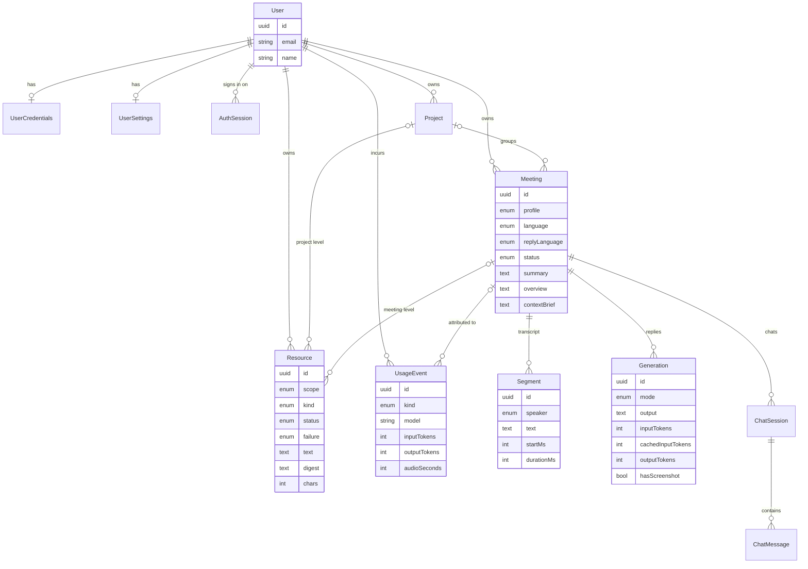

# Data model

Two stores with a clear split:

- **PostgreSQL** holds everything that must survive: users, meetings, transcripts, replies, chats, materials, usage.
- **Redis** holds what is read on every request during a live meeting, plus short-lived codes. Everything in Redis can be rebuilt from Postgres, so losing Redis loses only the live context of running meetings.

Original material files live in **Cloudflare R2** under `users/{userId}/resources/{id}`.

## PostgreSQL

Schema: [`backend/prisma/schema.prisma`](../../backend/prisma/schema.prisma). Models are PascalCase in code and snake_case in the database via `@map`. All ids are UUIDs.

### Tables

| Model             | Table              | Purpose                           | Notable fields                                                 |
| ----------------- | ------------------ | --------------------------------- | -------------------------------------------------------------- |
| `User`            | `users`            | Account                           | `email` unique                                                 |
| `UserCredentials` | `user_credentials` | How the user signs in             | `hashedPassword?` (argon2), `googleId?` unique                 |
| `AuthSession`     | `auth_sessions`    | One row per signed-in device      | `hashedRt` (argon2 of the refresh token), `expiresAt`          |
| `UserSettings`    | `user_settings`    | Server-side preferences           | `style?`, `defaultLanguage` (`uk`), `defaultProfile` (`daily`) |
| `Project`         | `projects`         | Group of meetings                 | `name`                                                         |
| `Meeting`         | `meetings`         | One call                          | see below                                                      |
| `Resource`        | `resources`        | Material for the AI               | see below                                                      |
| `Segment`         | `segments`         | One final transcript line         | `speaker`, `text`, `startMs`, `durationMs`                     |
| `Generation`      | `generations`      | One suggested reply               | `mode`, `output`, `stopReason?`, tokens, `hasScreenshot`       |
| `ChatSession`     | `chat_sessions`    | One chat about a finished meeting | `title?` from the first question                               |
| `ChatMessage`     | `chat_messages`    | A question and its answer         | `question`, `answer`                                           |
| `UsageEvent`      | `usage_events`     | Cost accounting                   | `kind`, `model?`, tokens, `audioSeconds`                       |

### `Meeting`

| Field                   | Meaning                                                                 |
| ----------------------- | ----------------------------------------------------------------------- |
| `profile`, `language`   | Chosen at start; `language` can change while live                       |
| `replyLanguage?`        | `null` = answer in whatever is being spoken                             |
| `status`                | `live` → `finished`. Lives only in Postgres, never in Redis             |
| `summary?`              | Dense rolling notes for the assistant. Never shown to people            |
| `overview?`             | Up to three sentences for the meeting screen, written once after finish |
| `contextBrief?`         | Materials frozen at start. The meeting chat reads the same text later   |
| `startedAt`, `endedAt?` |                                                                         |

### `Resource`

| Field         | Meaning                                                                                  |
| ------------- | ---------------------------------------------------------------------------------------- |
| `scope`       | `user`, `project` or `meeting`                                                           |
| `projectId?`  | Set only for `project`                                                                   |
| `meetingId?`  | Set for `meeting` once claimed. `null` + `scope: meeting` = staged before start          |
| `kind`        | `pdf`, `markdown`, `text`                                                                |
| `storageKey?` | Key in R2. Empty for hand-pasted text                                                    |
| `status`      | `pending` → `ready` or `failed`                                                          |
| `failure?`    | `unreadable`, `no_text_layer`, `storage` — a code, not a sentence; the app translates it |
| `text?`       | Extracted text, capped at `RESOURCE_EXTRACTED_MAX_CHARS`                                 |
| `digest?`     | Model-written compression when `text` exceeds the level's budget                         |
| `chars`       | Length of the extracted text                                                             |

### `UsageEvent.kind`

| Kind        | Written after                                  |
| ----------- | ---------------------------------------------- |
| `generate`  | Every reply                                    |
| `summarize` | Every rolling summary and overview             |
| `stt`       | Every closed speech stream (`audioSeconds`)    |
| `chat`      | Every chat answer, summed over all agent turns |
| `digest`    | Every material digest                          |

### Deletion

Everything hangs off `User` with `onDelete: Cascade`. Deleting a project cascades to its meetings and project-level materials; deleting a meeting cascades to segments, generations, chats and meeting materials. `UsageEvent.meetingId` is `SetNull`, so accounting survives the meeting.

### Migrations

In `backend/prisma/migrations`. Create one with `pnpm --filter backend prisma:migrate`. Production applies them via the `migrate` service in `docker-compose.prod.yml` before the backend starts.

## Redis

Every meeting key is known only to [`MeetingStateStore`](../../backend/src/modules/meetings/meeting-state.store.ts).

| Key                           | Type   | Contents                                                                               | Lifetime                                       |
| ----------------------------- | ------ | -------------------------------------------------------------------------------------- | ---------------------------------------------- |
| `meeting:{id}:state`          | hash   | `language`, `replyLanguage`, `profile`, `style`, `contextBrief`, `today`, `spokenUpTo` | TTL after finish                               |
| `meeting:{id}:window`         | list   | Fresh final segments as JSON                                                           | TTL after finish                               |
| `meeting:{id}:summary`        | string | Rolling summary                                                                        | TTL after finish                               |
| `meeting:{id}:turns`          | string | The last six conversation turns as JSON, with at most the newest screenshot            | deleted on finish                              |
| `meeting:{id}:summarize:lock` | string | Summarizer lock                                                                        | short TTL                                      |
| `meeting:{id}:alive`          | string | Heartbeat while audio flows                                                            | `LIVE_MEETING_IDLE_SECONDS`, deleted on finish |
| `settings:{userId}`           | string | Cached user settings                                                                   | TTL 5 minutes, dropped on save                 |
| `login:code:{code}`           | string | `userId` for the Google one-time code                                                  | 60 s, deleted on exchange                      |

"TTL after finish" is `FINISHED_MEETING_TTL_SECONDS` (one day by default).
