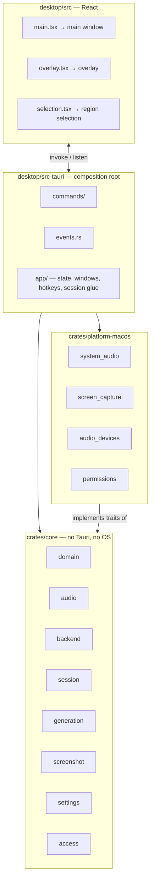

# Desktop structure

The desktop app is a Tauri 2 application: a Rust backend-of-the-app plus a React UI rendered in a webview. It is deliberately thin — it has no local database and never talks to AI providers.

## Stack

| Concern                      | Choice                                               |
| ---------------------------- | ---------------------------------------------------- |
| Shell                        | Tauri 2                                              |
| Core language                | Rust 2021, tokio                                     |
| UI                           | React 19, TypeScript strict, Vite, Tailwind, zustand |
| Microphone                   | `cpal`                                               |
| Resampling                   | `rubato`                                             |
| System audio and screenshots | ScreenCaptureKit via `objc2-screen-capture-kit`      |
| Audio devices                | CoreAudio via `objc2-core-audio`                     |
| HTTP and SSE                 | `reqwest`                                            |
| WebSocket                    | `tokio-tungstenite`                                  |
| Secrets                      | `keyring` (Keychain)                                 |
| Screenshot encoding          | `image`                                              |
| Plugins                      | global-shortcut, deep-link, dialog                   |
| Tests                        | cargo test, Vitest                                   |

## Layers



The dependency direction is strict: **core depends on nothing above it.** `platform-macos` implements core's traits, and `src-tauri` wires them together.

## Cargo workspace

```
desktop/
├── Cargo.toml                     workspace
├── crates/
│   ├── core/                      cueline_core
│   └── platform-macos/            macOS implementations
└── src-tauri/                     the Tauri binary
```

### `crates/core`

Platform-independent. Compiles and is tested without a UI and without macOS.

| Module        | Contents                                                                                                                                                                  |
| ------------- | ------------------------------------------------------------------------------------------------------------------------------------------------------------------------- |
| `domain/`     | `Meeting`, `Project`, `Resource`, `TranscriptSegment`, `Speaker`, `Language`, `MeetingProfile`, `GenerationMode`, `UserSettings`, session state — mirrors of backend DTOs |
| `audio/`      | `AudioSource` trait, `AudioFrame`, `MicrophoneSource` on cpal, `MonoResampler`, device listing                                                                            |
| `backend/`    | `BackendApi` and `SttGateway` traits, `BackendClient` implementation, SSE parser, transport with retries                                                                  |
| `session/`    | `Session` lifecycle, per-speaker `Lane`, `AudioSources` trait                                                                                                             |
| `generation/` | `Generator` — one in-flight reply request, `GenerationEvent`                                                                                                              |
| `screenshot/` | `ScreenCapture` trait, `shrink` to ≤1400 px JPEG ≤400 KB                                                                                                                  |
| `settings/`   | `LocalSettings`, `LocalSettingsStore`, `SecretStore` trait                                                                                                                |
| `access/`     | `AccessPolicy` trait, `Entitlement`, always-allowed policy                                                                                                                |
| `error.rs`    | The `thiserror` error enum                                                                                                                                                |
| `secret.rs`   | `Secret` — prints as `Secret(***)`                                                                                                                                        |

### `crates/platform-macos`

| Module            | Contents                                                                          |
| ----------------- | --------------------------------------------------------------------------------- |
| `capture_kit/`    | Shared ScreenCaptureKit helpers: content listing, `ThreadSafe`, `capture_allowed` |
| `system_audio/`   | `AudioSource` on ScreenCaptureKit, stream delegate, `CMSampleBuffer` parsing      |
| `screen_capture/` | `ScreenCapture` on `SCScreenshotManager`, region → display mapping                |
| `audio_devices/`  | CoreAudio transport type of each device (to spot Bluetooth)                       |
| `permissions/`    | Screen Recording permission, opening System Settings panes                        |

### `src-tauri`

| Path                                                  | Contents                                                              |
| ----------------------------------------------------- | --------------------------------------------------------------------- |
| `app/state.rs`                                        | `AppState` — settings, secret store, backend client, session, answers |
| `app/meeting_session.rs`                              | Glue between `Session` and Tauri events                               |
| `app/answers.rs`                                      | Glue between `Generator` and Tauri events                             |
| `app/meeting_chat.rs`                                 | Streams chat answers to the UI                                        |
| `app/hotkeys.rs`                                      | Registers global shortcuts from local settings                        |
| `app/overlay/`, `app/macos_window.rs`                 | Overlay window and the AppKit tweaks it needs                         |
| `app/selection.rs`, `app/screen_capture.rs`           | Region-selection window and capture                                   |
| `app/platform_sources.rs`, `app/microphone_choice.rs` | Picks audio sources; avoids Bluetooth microphones                     |
| `app/audio_check.rs`                                  | Level check in settings                                               |
| `app/shutdown.rs`                                     | Stops the session on exit                                             |
| `commands/`                                           | Thin Tauri commands, one file per area                                |
| `events.rs`                                           | Event names and payload types                                         |
| `deep_link.rs`                                        | `cueline://auth` handling                                             |
| `secrets/`                                            | Keychain store (release) and file store (debug)                       |
| `logging.rs`                                          | `tracing` to a daily-rotated file                                     |

## Core traits

Everything external hides behind a trait in core. Tests use fakes from `crates/core/tests/fakes`.

| Trait           | Purpose                                                       | Real implementation                                      |
| --------------- | ------------------------------------------------------------- | -------------------------------------------------------- |
| `AudioSource`   | `start(sink)` / `stop()` producing `AudioFrame`s              | `MicrophoneSource` (core), system audio (platform-macos) |
| `AudioSources`  | Factory: microphone by device id, optional system audio       | `src-tauri/app/platform_sources.rs`                      |
| `BackendApi`    | Every REST call, plus `generate` and `ask_in_chat` streams    | `BackendClient`                                          |
| `SttGateway`    | Opens a speech lane: a sink for frames and a stream of events | `BackendClient`                                          |
| `ScreenCapture` | Captures a `CaptureRect` into a `Screenshot`                  | platform-macos `screen_capture`                          |
| `SecretStore`   | Get, set, delete the token pair                               | Keychain / `0600` file                                   |
| `AccessPolicy`  | `check()` → `Allowed` or `Denied(reason)`                     | always allowed                                           |

`SttLane` is split into `SttSink` and `SttEvents` because a lane writes audio and reads transcript at the same time.

The full signatures are in [`ARCHITECTURE.md`](../ARCHITECTURE.md#traits).

## Rules

Detailed in [`.claude/skills/rust-core/SKILL.md`](../../.claude/skills/rust-core/SKILL.md) and [`.claude/skills/frontend/SKILL.md`](../../.claude/skills/frontend/SKILL.md).

- `crates/core` never depends on Tauri or an OS-specific crate.
- All backend calls go through `BackendApi`.
- Subscription state is checked only through `AccessPolicy`, at session start and at generation.
- Errors: `thiserror` enums in core, `anyhow` only at the Tauri boundary. No `unwrap` outside tests.
- Async on tokio; streams via `futures::Stream`, channels via `tokio::sync::mpsc`.
- IPC contracts live in `src-tauri/src/events.rs` and `src/shared/ipc` and change together.
- Frontend: feature folders under `src/features`, shared pieces under `src/shared`, function components, hooks for logic, zustand for cross-feature state, no default exports.

## Reliability

- The HTTP transport makes up to three attempts with exponential backoff from 300 ms, retrying only timeouts, connection errors and 5xx. A 404 or 409 is never retried. JSON requests time out after 10 seconds.
- A 401 triggers a token refresh and one replay of the request.
- Logs go through `tracing` into `app_log_dir` with daily rotation and seven files of history.
- `RunEvent::Exit` stops the audio check and the session, which finishes the meeting on the backend, within 5 seconds.

## More

- [Session, audio and generation](session-and-audio.md)
- [IPC between Rust and the UI](ipc.md)
- [Windows and UI](windows-and-ui.md)
