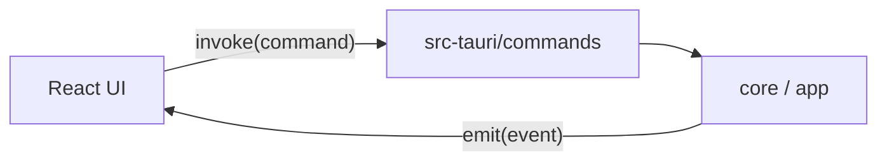

# IPC between Rust and the UI

The React UI talks to Rust in two directions:

- **Commands** — the UI calls `invoke(name, args)` and awaits a result.
- **Events** — Rust emits `name` with a payload, and every window that listens receives it.

Contracts are defined once in Rust and mirrored in TypeScript. **Change both together.**

| Side                          | File                                                                              |
| ----------------------------- | --------------------------------------------------------------------------------- |
| Rust event names and payloads | [`src-tauri/src/events.rs`](../../desktop/src-tauri/src/events.rs)                |
| Rust commands                 | [`src-tauri/src/commands/`](../../desktop/src-tauri/src/commands)                 |
| TS event types                | [`src/shared/ipc/events.ts`](../../desktop/src/shared/ipc/events.ts)              |
| TS command wrappers           | [`src/shared/ipc/commands.ts`](../../desktop/src/shared/ipc/commands.ts)          |
| TS subscription hooks         | `src/shared/ipc/useAppEvents.ts`, `useSessionEvents.ts`, `useGenerationEvents.ts` |

All payloads are `camelCase` on the wire (`#[serde(rename_all = "camelCase")]`).

## Commands

| Area                                  | Commands                                                                                                                                                                         |
| ------------------------------------- | -------------------------------------------------------------------------------------------------------------------------------------------------------------------------------- |
| **Auth** (`auth.rs`)                  | `auth_state`, `sign_in`, `start_login`, `complete_login`, `logout`                                                                                                               |
| **Session** (`session.rs`)            | `session_state`, `start_session`, `switch_meeting_language`, `stop_session`                                                                                                      |
| **Generation** (`generation.rs`)      | `generate`, `cancel_generation`                                                                                                                                                  |
| **Screen** (`screen.rs`)              | `finish_selection`, `cancel_selection`                                                                                                                                           |
| **Meetings and chat** (`meetings.rs`) | `list_meetings`, `get_meeting`, `rename_meeting`, `move_meeting`, `delete_meeting`, `meeting_chats`, `start_meeting_chat`, `chat_messages`, `delete_meeting_chat`, `ask_in_chat` |
| **Projects** (`projects.rs`)          | `list_projects`, `create_project`, `rename_project`, `delete_project`                                                                                                            |
| **Materials** (`resources.rs`)        | `list_resources`, `upload_resource`, `add_resource_text`, `get_resource`, `resource_content`, `resource_limits`, `delete_resource`                                               |
| **Settings** (`settings.rs`)          | `get_local_settings`, `save_local_settings`, `get_user_settings`, `save_user_settings`, `check_backend`                                                                          |
| **Audio** (`audio.rs`)                | `list_audio_devices`, `start_audio_check`, `stop_audio_check`, `system_audio_allowed`, `open_audio_permission`                                                                   |

Commands are thin: they unpack arguments, call into `AppState` or core, and convert the error with `anyhow` at the boundary. Errors reach the UI as a structured `command-error` that `src/shared/lib/command-error.ts` turns into a message in Ukrainian.

Notes:

- `upload_resource` takes a **path**, not bytes: the file picker returns a path and Rust reads the file, checking the extension before contacting the server.
- `start_session` returns `systemAudioProblem` when the meeting started without system audio.
- `stop_session` cancels any running generation before stopping the session.

## Events

| Event                 | Payload                                             | Who listens                     |
| --------------------- | --------------------------------------------------- | ------------------------------- |
| `auth:state`          | `{ signedIn, profile? }`                            | Main window                     |
| `session:state`       | `{ state, meetingId?, message? }`                   | Main window, overlay            |
| `source:status`       | `{ speaker, active }` — once per source after start | Session sidebar                 |
| `audio:level`         | `{ speaker, level }`                                | Level meters                    |
| `transcript:segment`  | `{ id, speaker, text, isFinal }`                    | Overlay                         |
| `generation:started`  | `{ mode, withScreenshot }`                          | Overlay, history                |
| `generation:delta`    | `{ text }`                                          | Overlay                         |
| `generation:finished` | `{ generationId, usage }`                           | Overlay                         |
| `generation:failed`   | `{ message }`                                       | Overlay                         |
| `chat:delta`          | `{ chatId, text }`                                  | Chat screen                     |
| `chat:finished`       | `{ chatId, messageId }`                             | Chat screen                     |
| `chat:failed`         | `{ chatId, message }`                               | Chat screen                     |
| `overlay:interaction` | `{ interactive }`                                   | Overlay (highlights its border) |
| `app:error`           | `{ kind, failure?, message }`                       | Main window error strip         |

### `app:error`

| Field     | Values                                                                                               |
| --------- | ---------------------------------------------------------------------------------------------------- |
| `kind`    | `audio`, `backend`, `settings`, `permission`, `access`, `resource`, `screen`, `session`, `cancelled` |
| `failure` | `unauthorized`, `notFound`, `conflict`, `unavailable`, `unexpected` — for backend errors             |

The strip at the bottom of the main window disappears by itself after twelve seconds (`shared/lib/useTransientMessage`). A strip that hangs around reads as the state of the last action: the permission is already granted while the screen still says it is missing.

### Behaviour worth knowing

- **Chat events carry `chatId`, not the meeting id**, so a chat screen takes only its own.
- **`source:status`** arrives once per source right after start. Before a meeting, the system-audio status comes from `system_audio_allowed`; otherwise it would hang on "not checked" even when permission is granted. A click on a source row calls `open_audio_permission`, which for meeting audio opens Screen Recording, not Microphone.
- **Windows do not share memory.** The overlay has its own React root and its own stores. That is why the session clears its transcript and reply on `Idle` instead of relying on a call in the main window.
