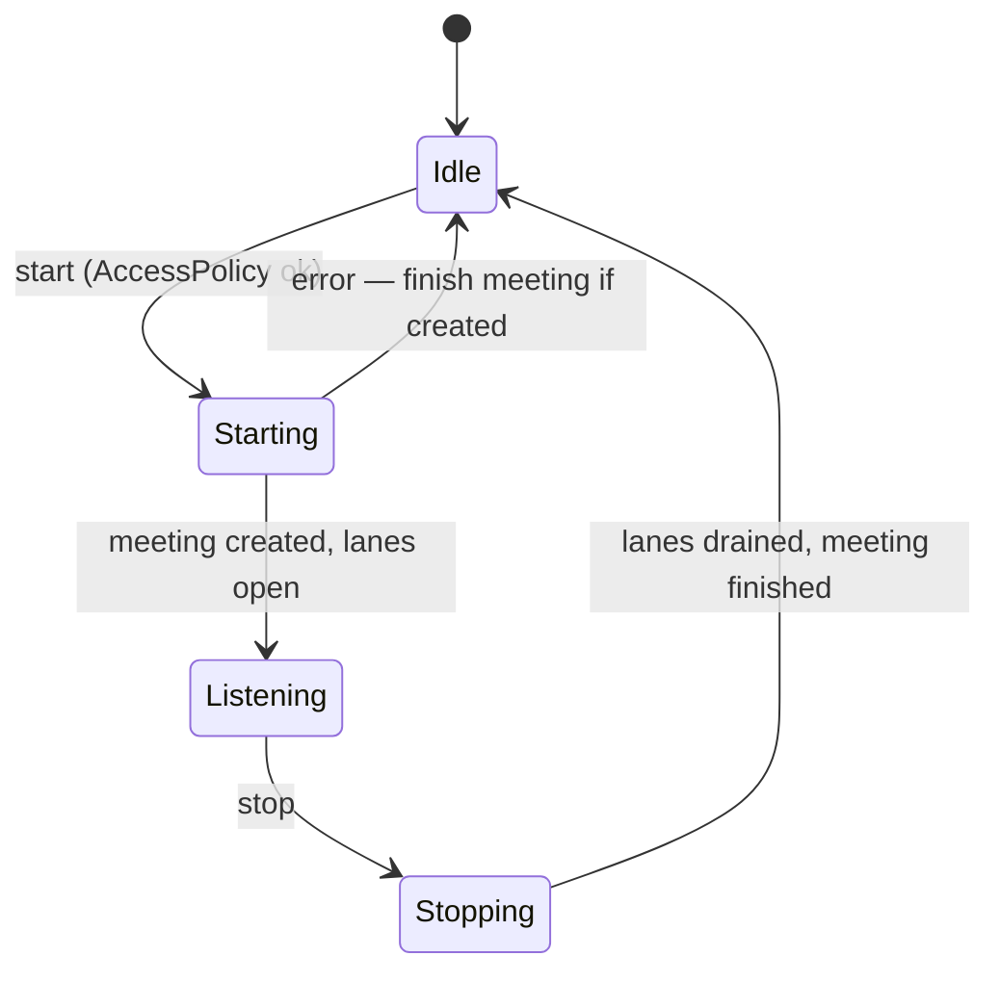
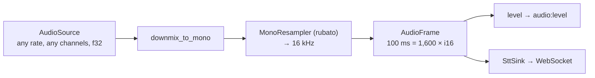
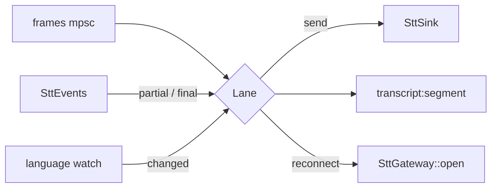
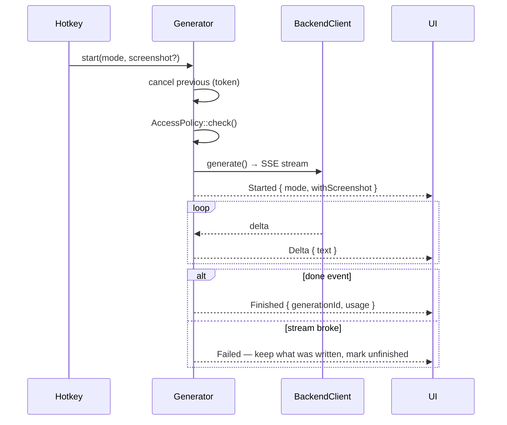
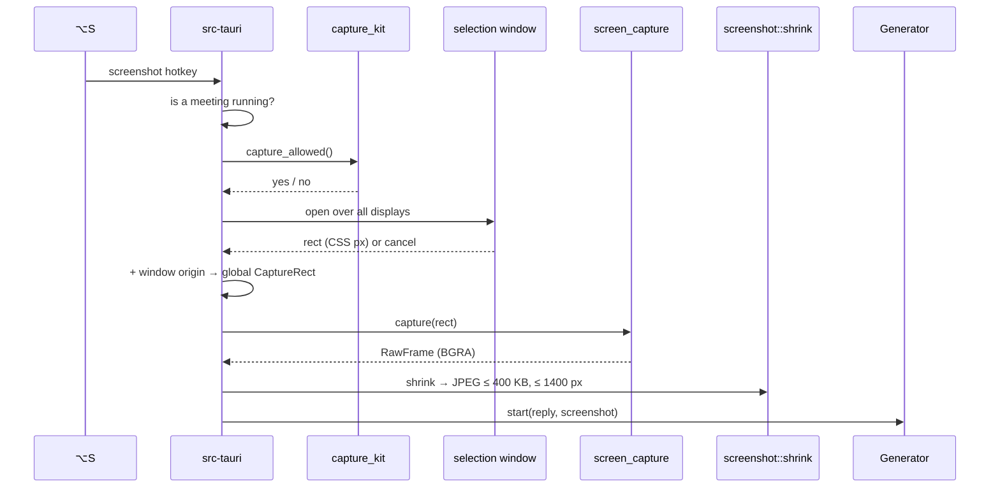

# Session, audio and generation

## Session

`Session` ([`crates/core/src/session/lifecycle.rs`](../../desktop/crates/core/src/session/lifecycle.rs)) owns everything that lives between start and stop: audio sources, speech lanes, the transcript for display.

Every transition is published as a `session:state` event.

### Start

1. `AccessPolicy::check()`.
2. `BackendApi::create_meeting` with profile, language, reply language, project and staged resource ids.
3. Open the microphone and, if available, system audio.
4. Start one lane per source.
5. Emit `source:status` for each source.

Missing system audio does not block the start. The meeting runs with the microphone alone and the reason is returned as `systemAudioProblem`.

### Stop

Stop asks each lane to finish and **reads it to the end**. The backend sends the last phrase only after the close request, so dropping the socket would lose it. Then `finish_meeting`.

Before stopping, `stop_session` cancels any reply still being written, so the overlay empties cleanly.

## Audio pipeline

| Constant            | Value                         |
| ------------------- | ----------------------------- |
| `SAMPLE_RATE_HZ`    | 16,000                        |
| `FRAME_DURATION_MS` | 100                           |
| `SAMPLES_PER_FRAME` | 1,600                         |
| Wire format         | PCM `i16` little-endian, mono |

### Sources

| Speaker | Source                        | Where                                    |
| ------- | ----------------------------- | ---------------------------------------- |
| `me`    | `MicrophoneSource` on cpal    | `crates/core/src/audio/microphone.rs`    |
| `other` | ScreenCaptureKit audio stream | `crates/platform-macos/src/system_audio` |

**Bluetooth.** When an app opens a Bluetooth headset's microphone, macOS switches the headset from A2DP to the telephony profile (16 kHz mono) and the meeting starts sounding like a phone. That cannot be avoided from the app, so when no microphone is chosen explicitly, `app/microphone_choice.rs` asks CoreAudio for the transport of each device and substitutes the built-in microphone. See [ADR-0015](../decisions/0015-avoid-bluetooth-microphone.md).

## Lanes

A lane ([`session/lane.rs`](../../desktop/crates/core/src/session/lane.rs)) is one speaker's path: frames in, transcript events out.

- **Reconnect:** a dropped socket does not end the meeting. The lane reopens with the same meeting, up to five attempts with growing pauses. Close codes 4401 and 4404 are not retried.
- **Silent source:** if the audio source goes quiet for good, the lane reports it in the transcript and stops.
- **Language switch:** the session holds a `watch` channel. When the language changes, lanes flush and close their sockets and open new ones. Sources keep running, so the phrase spoken at the moment of switching is not lost.

## Generation

`Generator` ([`generation/runner.rs`](../../desktop/crates/core/src/generation/runner.rs)) lives outside the session and holds only the current request.

- A new start cancels the previous request. Cancelling simply drops the stream; the disconnect reaches the backend, which saves the partial reply.
- The generation HTTP client has **no overall timeout**, only a connect timeout: a reply takes as long as it takes.
- SSE parsing is shared: `sse::frames` yields frames, and each feature (generation, chat) reads its own `done` payload.

## Screenshots

- **Permission first.** `capture_kit::capture_allowed` asks ScreenCaptureKit itself; `CGPreflightScreenCaptureAccess` lies. Without permission the app says so instead of letting you draw a rectangle into the void. The same call answers whether meeting audio is available — both rely on one permission.
- **In-process capture.** `SCScreenshotManager` inside our own process, not `/usr/sbin/screencapture`. A child process is checked against the "responsible" process of its chain (in development, the IDE), and without permission it silently returns the wallpaper. See [ADR-0011](../decisions/0011-in-process-screen-capture.md).
- **Multi-display.** `screen_capture` finds the `SCDisplay` containing the centre of the rectangle, sets `sourceRect` relative to that display and derives the pixel size from its own density, so Retina captures are native and a normal neighbouring display is not upscaled. A rectangle spanning two displays is clipped to the one holding its centre.
- **Compression in core.** `screenshot::shrink` reads BGRA respecting `stride`, scales the long side to 1,400 px and encodes JPEG, lowering quality until it fits 400 KB.
- A second press while the screen is already dimmed does nothing.
- The question is not typed: the backend takes it from the conversation, exactly as for a normal reply.

## Hotkeys

Read from local settings and re-registered whenever they are saved (`app/hotkeys.rs`). While the region selection is open, `Esc` is registered as a temporary global shortcut so cancelling works even without key-window status.

| Setting       | Default                    | Action                                       |
| ------------- | -------------------------- | -------------------------------------------- |
| `reply`       | `Alt+R`                    | `Generator::start(Reply)`                    |
| `alternative` | `CommandOrControl+Shift+A` | `Generator::start(Alternative)`              |
| `screenshot`  | `Alt+S`                    | Region selection, then reply with screenshot |
| `hide`        | `CommandOrControl+Shift+H` | Show or hide the overlay                     |
| `interact`    | `CommandOrControl+Shift+M` | Toggle mouse interaction in the overlay      |
