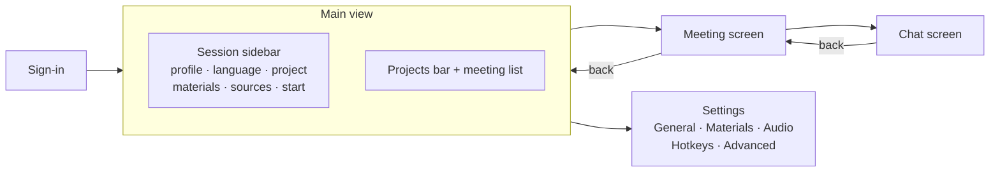
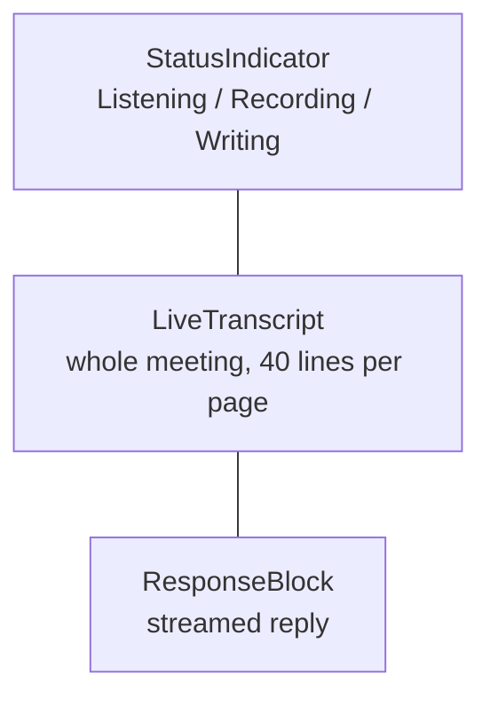

# Windows and UI

## Three windows

| Window        | Entry point                            | Lives                                   | Purpose                                                           |
| ------------- | -------------------------------------- | --------------------------------------- | ----------------------------------------------------------------- |
| **Main**      | `index.html` → `src/main.tsx`          | Always                                  | Sign-in, meeting setup, history, projects, settings, meeting chat |
| **Overlay**   | `overlay.html` → `src/overlay.tsx`     | From app start, hidden by hotkey        | Session status, live transcript, the latest reply                 |
| **Selection** | `selection.html` → `src/selection.tsx` | Only while choosing a screenshot region | Dims all displays, lets you drag a rectangle                      |

Each window has its own React root, its own stores and its own capability file in `src-tauri/capabilities/`.

## Main window



- Screens are variants of `View` in `app/App.tsx`, not separate windows or routes. The back arrow in the title bar returns one level.
- `titleBarStyle: "Overlay"` with a hidden title: the traffic lights are native and `app/TitleBar.tsx` draws the rest.
- The first screen is sign-in. There is no onboarding: server address, device and hotkeys sit behind the gear, and macOS permissions are requested at the first meeting.

### Projects and the meeting list

- The projects bar (`features/projects/ProjectsBar`) sits above the list, with "No project" first. Clicking a card filters the list; clicking again shows everything. There is no separate project screen.
- A meeting is moved by dragging its row onto a card. The row carries its id under the custom MIME type `application/x-cueline-meeting`: drag data is unreadable until the drop, but the list of types is readable, so a card knows on `dragover` that a meeting is flying over it and highlights only then.
- Tauri's native drag-and-drop is off in the main window (`dragDropEnabled: false`); it is only for OS files and conflicts with HTML5 drag inside the webview.
- Rename in place via `shared/lib/useRename`; delete via `ConfirmDialog`.
- Both lists re-read from the backend after any change: a `revision` number in `MainWindow` grows on every successful action, and `useProjects` and `useMeetings` reload when it changes. A drag changes two lists and two counters at once, so patching locally would drift from the server.
- The meeting list loads pages as you scroll (`useEndOfList`).

### Materials panel

`features/resources` is one panel for all three levels; the only difference is the `ResourceScope` passed in.

- `useResources` polls while any material is `pending`, with `setInterval` rather than a single `setTimeout`, because the set of pending ids does not change while they are read and the effect would not re-run.
- The Start button stays busy while any material is being read: the brief is built from what is already read.
- `ResourceViewer` shows the extracted text, or the digest when the document exceeded its budget, since that is what the model sees.

### Meeting and chat screens

- The meeting screen has a chat list on the left (search, "New chat") and cards in the centre: overview, transcript, replies, materials, cost.
- The cost is estimated on the client in `features/history/cost.ts` from one set of rate constants. Exact money will come with the subscription and will be computed by the backend.
- The chat screen looks like a messenger: question on the right in an accent bubble, answer on the left, the thread sticks to the bottom until you scroll up. The same chat list stays on the left, with the open chat outlined.

## Overlay



| Property                                  | How                                                                                                 | Why                                                                     |
| ----------------------------------------- | --------------------------------------------------------------------------------------------------- | ----------------------------------------------------------------------- |
| Invisible in screen sharing               | `set_content_protected(true)`                                                                       | The whole point. Side effect: also missing from ordinary screenshots    |
| Clicks pass through                       | `set_ignore_cursor_events(true)`                                                                    | A button in the browser under the overlay still works                   |
| Interaction mode                          | `interact` hotkey, `overlay:interaction` event                                                      | Only then can you drag, resize, scroll and select                       |
| Above full-screen apps and on every Space | `NSScreenSaverWindowLevel`, `CanJoinAllSpaces \| FullScreenAuxiliary \| Stationary \| IgnoresCycle` | Must be visible over a full-screen Meet or Zoom                         |
| Glass look                                | `transparent: true` + `macOSPrivateApi`                                                             | Without it `backdrop-filter` paints a solid rectangle                   |
| Soft shadow                               | `shadow: false`, CSS shadow                                                                         | The system shadow draws a rectangular frame around a transparent window |
| No buttons                                | —                                                                                                   | Copy is text selection in interaction mode; regenerate is a hotkey      |

### The NSPanel trick

`CanJoinAllSpaces` alone is not enough: a regular window of an app with a Dock icon stays on the Space where it was opened. Only an `NSPanel` goes everywhere. So `app/macos_window.rs` temporarily swaps the window's class to `NSPanel` while setting the flags (bringing in the `NonactivatingPanel` style) and swaps it straight back. It cannot stay a panel: tao hands out `NSKVONotifying_TaoWindow`, and a permanent class swap breaks the KVO observers AppKit holds on the window — the app crashes on `removeObserver`. Flags are reapplied on every show, always on the main thread via `run_on_main_thread`. See [ADR-0009](../decisions/0009-overlay-window.md).

### Positioning and dragging

- The position is set once, on the monitor under the cursor, and **after** `show()`: tao centres the window on first show and would discard an earlier position.
- Dragging is a custom `pointerdown` handler calling `setPosition` (`useOverlayDrag`), not `data-tauri-drag-region`: the region ignores presses that land on a child element, and the header is almost all children.

### Verifying it

Because content protection hides the overlay from screenshots, check its presence with `CGWindowListCopyWindowInfo`, and its Space membership with the private `CGSCopySpacesForWindows` — the answer should list every Space.

## Selection window

- Created by `app/selection.rs` on the hotkey and closed as soon as a rectangle is chosen or the choice is cancelled.
- **One window covering the union of all displays**, because the question is usually about a screen other than the one the app is on.
- Created on the main thread via `run_on_main_thread` (AppKit accepts no other), while the hotkey runs on a tokio worker.
- Uses the same `macos_window.rs` code as the overlay and stays a `NonactivatingPanel`: an activating window would pull the user to the app's Space, while the region must be chosen where the browser is. It becomes key via `makeKeyAndOrderFront`.
- Content-protected, so the dimming never ends up in the capture.
- Reused if it still exists: Tauri's `close()` is a message to the event loop, so a just-closed window still holds its label and a new one would fail with "webview with label `selection` already exists".
- `features/generation/RegionSelector` draws the dim layer with a cut-out; `Esc` or right-click cancels.

## Frontend structure

```
desktop/src
├── main.tsx, overlay.tsx, selection.tsx    one entry per window
├── app/                                    screens and window shells
├── features/
│   ├── access/        useAccess — paywall hook
│   ├── auth/          sign-in screen, Google button
│   ├── session/       sidebar: profile, language, project, sources, start
│   ├── generation/    overlay: transcript, reply, status, region selector
│   ├── history/       meeting list, meeting details, cost
│   ├── projects/      projects bar and cards
│   ├── resources/     materials panel, viewer
│   ├── chat/          chat list, thread, composer
│   └── settings/      settings tabs
└── shared/
    ├── ipc/           commands, events, subscription hooks
    ├── store/         zustand: auth, session, generation
    ├── ui/            Button, Select, Panel, ConfirmDialog, icons…
    ├── lib/           formatting, rename, drag, transient message
    ├── i18n/          uk.ts — all UI strings
    └── theme/         tokens.css
```

Principles:

- Components receive data through props; hooks over stores assemble state. No component knows about Tauri.
- Screens are compositions of small components: the session sidebar is `ProfileSwitcher`, `LanguageSelect`, `AudioSourceStatus`, `StartMeetingButton`; the overlay is `StatusIndicator`, `LiveTranscript`, `ResponseBlock`.
- UI text is Ukrainian and lives in `shared/i18n/uk.ts`.

## Theme

Colours, typography, spacing and radii come from the design system as one file, `src/shared/theme/tokens.css`, generated from its `tokens.json`. It declares tokens in Tailwind's `@theme`, so they become utilities (`bg-surface-elevated`, `text-body`, `p-5`, `rounded-lg`). Dark mode is the same names with other values under `prefers-color-scheme: dark` and `[data-theme='dark']`. Components never write hex colours — that rule also saves the code from "if dark theme" branches.
