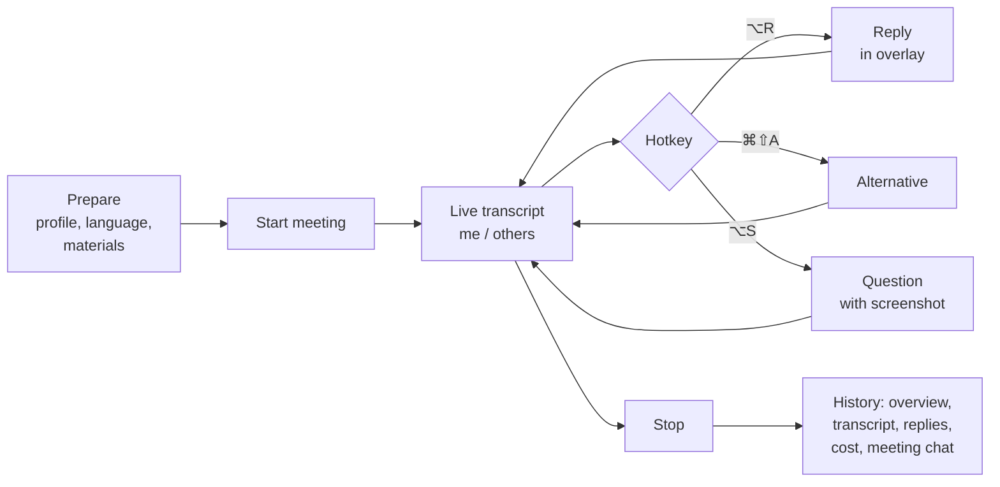

# Product overview

## What it is

Cueline is a macOS desktop app that sits next to you in an online meeting. It hears both sides of the conversation, keeps a transcript, and when you press a hotkey it suggests within a second or two what to say next: one short spoken reply in the first person that takes about fifteen seconds to read aloud.

It works with any call service — Google Meet, Zoom, Teams, Slack — because it listens to the system audio and the microphone, not to the service.

## Who it is for

| Scenario                                 | What Cueline gives you                                                                                                                               |
| ---------------------------------------- | ---------------------------------------------------------------------------------------------------------------------------------------------------- |
| **Job interview, you are the candidate** | A reply with a concrete example from your résumé, correctly counted years of experience, an answer to a technical question from a screenshot         |
| **Client call**                          | A reply as the person responsible: what was raised, the substance, the next step and who owns it, with no promises the conversation does not support |
| **Team stand-up**                        | Short and to the point: what is done, what blocks, what is next                                                                                      |

The conversation can be in Ukrainian, English or Russian, and the language can be switched in the middle of a call.

## How it looks

1. **Before the call** you pick a meeting profile and language and optionally add materials: a résumé, a job description, notes about the client.
2. **During the call** the overlay shows the live transcript. When you need a hint, you press the hotkey and the reply streams into the overlay word by word.
3. **After the call** the meeting sits in history with a short overview, the full transcript, every reply and the cost. You can ask it questions in a chat: "what did they ask me about React?", "how long was the meeting?".

## What sets it apart

- **Invisible when sharing the screen.** The overlay is excluded from screen capture and never takes focus from the call window.
- **Stays out of the way.** Clicks go through the overlay into the window below; it catches the mouse only in a dedicated mode.
- **Knows the context.** Materials on three levels — about you, about the project, about this meeting — with a predictable priority when they disagree.
- **Answers what was asked.** "Hi, how are you" gets one sentence, not a self-introduction. An example from experience comes only when experience is asked about.
- **Thin client.** No provider keys in the app. All logic, prompts and data live on the server.

## Glossary

| Term                    | Meaning                                                                                               |
| ----------------------- | ----------------------------------------------------------------------------------------------------- |
| **Meeting**             | One call from start to stop. Has a profile, language, transcript, replies, cost                       |
| **Profile**             | Meeting type: stand-up, interview as candidate, client call. Shapes how the assistant phrases a reply |
| **Segment**             | One final transcript line with a speaker label                                                        |
| **Speaker**             | `me` — your microphone, `other` — system audio, i.e. everyone else                                    |
| **Generation**          | One suggested reply. Mode `reply` answers, `alternative` rephrases the previous one                   |
| **Style**               | Your description of how you talk. Empty means the default: brief, conversational, no corporate filler |
| **Project**             | A group of meetings: all rounds of one interview, all calls with one client                           |
| **Material** (resource) | A PDF, Markdown file or pasted text the assistant sees as reference                                   |
| **Context brief**       | Text assembled from the three levels of materials at the moment the meeting starts                    |
| **Summary**             | Dense notes about the older part of the conversation that feed the assistant. Never shown to a person |
| **Overview**            | Up to three sentences about what a finished meeting was about — what a person sees                    |
| **Overlay**             | The transparent always-on-top window with the transcript and the reply                                |

## First-version limits

- macOS 13+ only. The code is ready for Linux and Windows by replacing a single audio-capture module.
- A meeting starts manually; there is no call auto-detection.
- Other participants are not separated from each other: everything that comes from the system is "others".
- No subscription yet: `SubscriptionGuard` and `AccessPolicy` let everyone through, but their places are ready.
- Screenshots are not stored in history, only a flag that the reply saw the screen.

Next: [Features](features.md).
